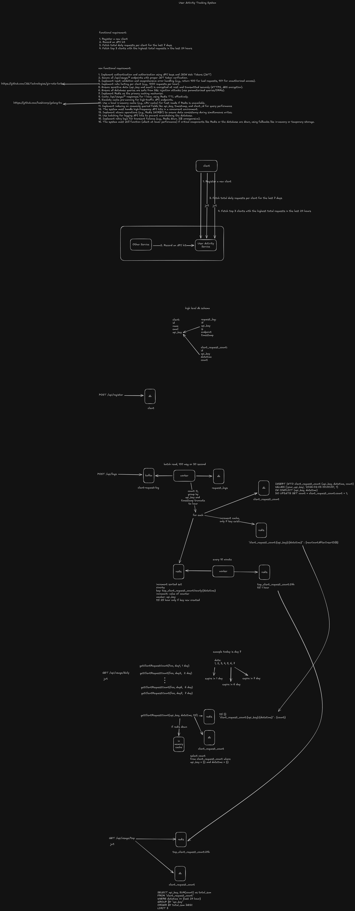

# User Activity Tracking Go

A high-performance user activity tracking system built with Go, featuring real-time request logging, analytics, and comprehensive monitoring capabilities.



## Features

- **Real-time Request Logging** - Track API hits with async processing via Kafka
- **Client Analytics** - Top 3 client request count (last 24 hours), daily request statistics
- **JWT Authentication** - Secure API access with JSON Web Tokens
- **Rate Limiting** - Protect APIs from abuse
- **Caching** - Redis caching with LRU in-memory fallback
- **Batch Processing** - Efficient Kafka message consumption in batches
- **Swagger Documentation** - Auto-generated API documentation

## Tech Stack

| Category | Technology |
|----------|------------|
| Language | Go 1.25+ |
| Framework | Gin |
| Database | PostgreSQL 16 |
| Cache | Redis 7 |
| Message Queue | Kafka (Confluent) |
| ORM | GORM |
| Scheduler | robfig/cron |
| Documentation | Swaggo |

## Architecture

The system consists of three main components:

1. **Web Server** (`cmd/web`) - HTTP API server with Swagger documentation
2. **Worker** (`cmd/worker`) - Kafka consumer for async message processing
3. **Cron** (`cmd/cron`) - Scheduled jobs for analytics aggregation

## Prerequisites

Ensure you have the following tools installed:

```bash
make check-tools
```

Required tools:
- [Go](https://go.dev/) 1.25+
- [Docker](https://www.docker.com/)
- [migrate](https://github.com/golang-migrate/migrate) - Database migrations
- [swag](https://github.com/swaggo/swag) - Swagger generation
- [moq](https://github.com/matryer/moq) - Mock generation
- [golangci-lint](https://golangci-lint.run/) - Linting

## Getting Started

### 1. Start Infrastructure

```bash
make docker-compose
```

This starts PostgreSQL, Redis, Zookeeper, Kafka, and AKHQ (Kafka UI).

### 2. Run Database Migrations

```bash
make migrate
```

### 3. Start the Application

Run each in a separate terminal:

```bash
# Web server (API)
make run

# Kafka worker
make run-worker

# Cron scheduler
make run-cron
```

### 4. Access the API

- **Swagger UI**: http://localhost:9090/swagger/index.html
- **Kafka UI (AKHQ)**: http://localhost:8080

## Configuration

Edit `config.json` to customize settings:

```json
{
  "database": { ... },
  "redis": { ... },
  "kafka": { ... },
  "jwt": { ... },
  "cron": { ... }
}
```

## Development

### Code Generation

```bash
# Generate mocks and format code
make clean
```

### Swagger Documentation

```bash
# Regenerate Swagger docs
make swag
```

### Create New Migration

```bash
make migrate-new
# Then run: migrate create -ext sql -dir db/migrations create_table_xxx
```

### Linting

```bash
make format
```

## Project Structure

```
.
├── api/                    # Swagger generated files
├── cmd/
│   ├── web/               # HTTP API server entrypoint
│   ├── worker/            # Kafka consumer entrypoint
│   ├── cron/              # Cron scheduler entrypoint
│   └── migrate/           # Database migration runner
├── db/
│   └── migrations/        # SQL migration files
├── internal/
│   ├── cache/             # Redis cache layer
│   ├── config/            # Configuration setup
│   ├── converter/         # DTO converters
│   ├── delivery/          # HTTP handlers & Kafka consumers
│   ├── entity/            # Database entities
│   ├── gateway/           # External service integrations
│   ├── model/             # Request/response models
│   ├── repository/        # Database repositories
│   └── usecase/           # Business logic
├── pkg/                   # Shared utilities and constants
├── config.json            # Application configuration
├── docker-compose.yml     # Infrastructure services
└── Makefile              # Build and run commands
```

## Services (Docker Compose)

| Service | Port | Description |
|---------|------|-------------|
| PostgreSQL | 5432 | Primary database |
| Redis | 6379 | Cache & session store |
| Kafka | 9092 | Message queue |
| Zookeeper | 2181 | Kafka coordination |
| AKHQ | 8080 | Kafka management UI |

## License

MIT
